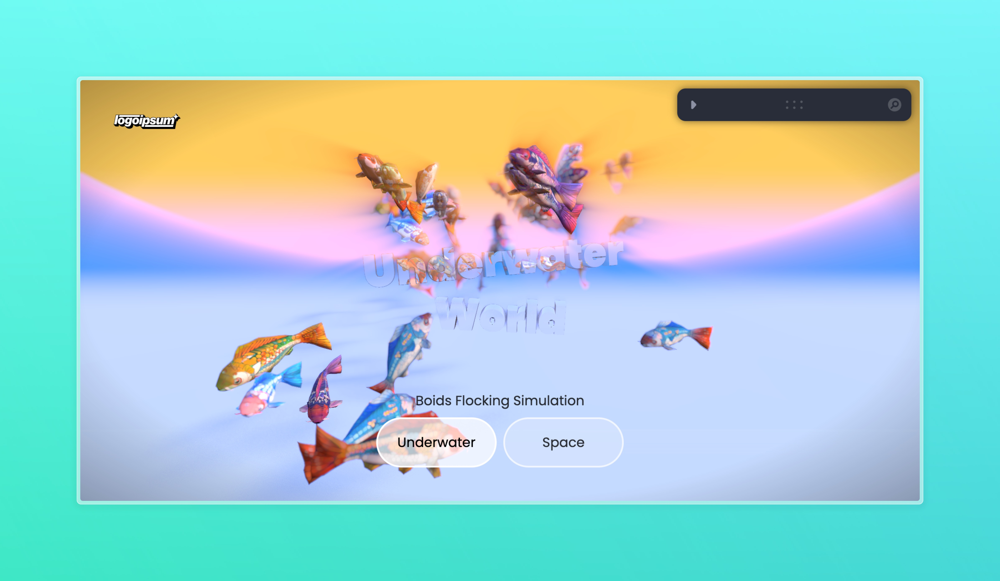
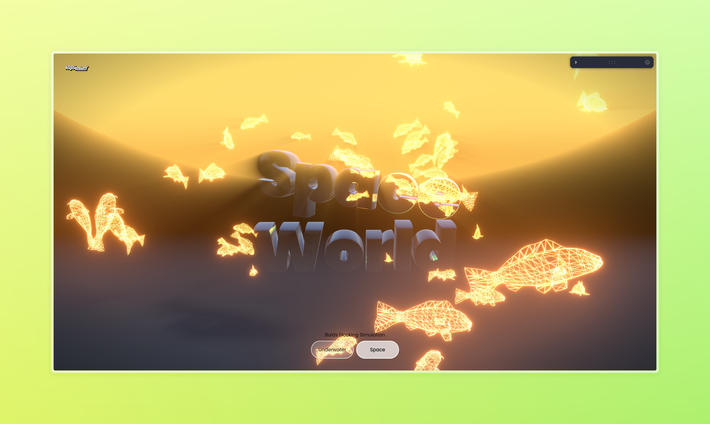

# 🎮 Boids Simulation



[](https://opensource.org/licenses/MIT)
[](https://reactjs.org/)
[](https://threejs.org/)
[](https://docs.pmnd.rs/react-three-fiber/)

An interactive 3D Boids simulation built with React Three Fiber. This project demonstrates flocking behavior using Craig Reynolds' Boids algorithm.



## 🌟 Features

- Real-time 3D flocking simulation
- Interactive camera controls
- Customisable boid parameters
- Smooth animations and transitions
- Responsive design

## 🚀 Getting Started

### Prerequisites

- Node.js (v14 or higher)
- npm or yarn

### Installation

1. Clone the repository
```bash
git clone https://github.com/pakagronglb/boids-3d-flocking-simulation.git
```

2. Install dependencies
```bash
cd boids-3d-flocking-simulation
npm install
```

3. Run the development server
```bash
npm run dev
```

## 🛠️ Built With

- [React](https://reactjs.org/) - Frontend framework
- [Three.js](https://threejs.org/) - 3D graphics library
- [React Three Fiber](https://docs.pmnd.rs/react-three-fiber/) - React renderer for Three.js
- [Vite](https://vitejs.dev/) - Frontend build tool

## 📝 License

This project is licensed under the MIT License - see the [LICENSE](LICENSE) file for details.

## 🙏 Acknowledgments

- Special thanks to [Wawa Sensei](https://www.youtube.com/@WawaSensei) for the inspiration and tutorial on Boids simulation
- Based on the tutorial: [Building Boids Simulation](https://www.youtube.com/watch?v=WepzbxlYROs)
- Craig Reynolds for the original Boids algorithm

## 🤝 Contributing

Contributions, issues, and feature requests are welcome! Feel free to check the [issues page](https://github.com/yourusername/boids-simulation/issues).

## 📧 Contact

Your Name - [@pakagronglb](https://github.com/pakagronglb)

Project Link: [https://github.com/pakagronglb/boids-3d-flocking-simulation](https://github.com/pakagronglb/boids-3d-flocking-simulation)

